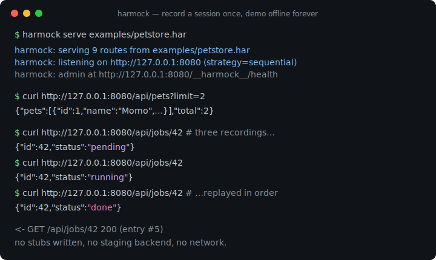
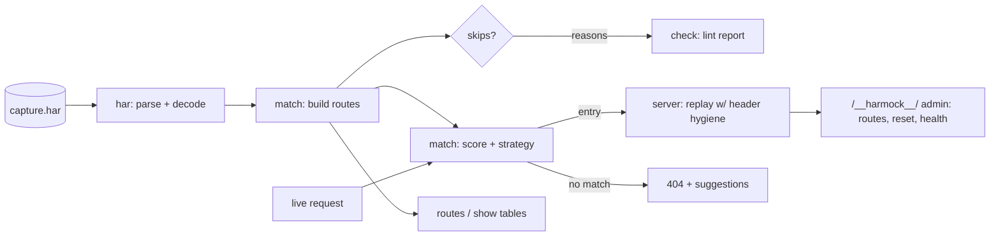

# harmock

[English](README.md) | [中文](README.zh.md) | [日本語](README.ja.md)

[](LICENSE) [](go.mod) [](CHANGELOG.md)  [](CONTRIBUTING.md)

**harmock：任意の HAR キャプチャを決定論的なローカル mock API サーバーとして配信する、オープンソース・依存ゼロの CLI——DevTools で実ブラウザのトラフィックを一度録るだけで、以後はオフラインで永遠にデモ・テストできる。スタブの手書きは不要。**



```bash
git clone https://github.com/JaydenCJ/harmock && cd harmock
go build -o harmock ./cmd/harmock    # single static binary, stdlib only
```

> プレリリース：v0.1.0 はまだどのパッケージレジストリにも公開されていません。上記の手順でソースからビルドしてください（Go ≥1.22 なら可）。

## なぜ harmock か？

どのフロントエンドチームも、いずれ不安定な staging バックエンド、期限切れのサンドボックストークン、会場 Wi-Fi でのデモに午後を一つ潰します。定番の解決策である mock サーバーは、問題を別の問題に置き換えるだけです：json-server は偽のデータベース設計を、WireMock と Mockoon はエンドポイントごとのスタブ定義の手書きを、Prism はバックエンドチームが持っていないかもしれない OpenAPI 仕様を要求します。しかし API の完璧な記述はすでに存在します——ブラウザが DevTools セッションのたびに記録する HAR ファイルです。そこには本物のステータスコード、本物のヘッダー、本物のボディ、本物の所要時間が入っています。harmock はそのファイルをそのまま配信します。DevTools を開いてフローを一度クリックし、"Save all as HAR with content" を実行して `harmock serve capture.har` と打てば、当時の本番とまったく同じ応答をする mock バックエンドが手に入ります——厄介な部分も込みで：クエリとリクエストボディで正しい記録を選び、同一エンドポイントの複数キャプチャを記録順に再生し（だから `pending → running → done` のポーリングフローが動く）、デコード済み HAR ボディを壊す録画上の `Content-Encoding` を剥がします。

| | harmock | json-server | Mockoon | WireMock | Prism |
|---|---|---|---|---|---|
| スタブを書かずに録画トラフィックを配信 | ✅ | ❌ | ⚠️ 部分的（専用レコーダー） | ⚠️ 部分的（プロキシ録画） | ❌ OpenAPI が必要 |
| 入力は素の DevTools エクスポート | ✅ | ❌ | ❌ | ❌ | ❌ |
| 重複記録のステートフルな順次再生 | ✅ | ❌ | ❌ | ⚠️ シナリオを手動定義 | ❌ |
| パスだけでなくクエリ + JSON ボディで照合 | ✅ | ❌ | 手動ルール | 手動ルール | スキーマのみ |
| ランタイム依存 | 0（単一バイナリ） | Node + 依存 | Electron/Node | JVM | Node + 依存 |
| オフライン・テレメトリなし・127.0.0.1 バインド | ✅ | ✅ | ⚠️ デスクトップアプリ | ✅ | ✅ |

<sub>依存数は 2026-07-13 に確認：harmock は Go 標準ライブラリのみを import。json-server 1.0.0-beta は npm から 21 パッケージ、@stoplight/prism-cli は 60 以上を取得。</sub>

## 特徴

- **スタブゼロ・設定ゼロ** —— HAR ファイル*こそ*が設定。Chrome、Firefox、Safari、プロキシ、クローラーのどのキャプチャもそのまま配信でき、壊れたエントリは理由付きでスキップされ、全体が失敗することはない。
- **決定論的なスコアベース照合** —— メソッド + パスの一致を必須とし、クエリパラメータ、リクエストボディ（バイト一致または JSON 構造一致なのでキー順は無関係）、オプトインしたヘッダーで候補を順位付け。同じキャプチャ + 同じリクエスト = 毎回同じレスポンス。
- **ステートフルなフロー向けの順次再生** —— 3 回記録されたエンドポイントは `pending → running → done` を記録順に再生し、その後は最終状態に留まる。`POST /__harmock__/reset` でテスト実行の合間に巻き戻せる。
- **忠実な応答、要所だけ補正** —— 記録されたステータス・ヘッダー・ボディをそのまま再生しつつ、hop-by-hop ヘッダーと、デコード済みボディを壊す古い `Content-Encoding`/`Content-Length` は除去。バイナリペイロードはバイト単位で一致して返る。
- **診断可能な 404** —— マッチしないリクエストにはリクエスト自体と最大 3 件の近似候補を記した JSON が返り、「なぜマッチしなかったか」が数分ではなく数秒で分かる。
- **フロントエンド向けスイッチ** —— `--cors` は記録済み CORS を上書きして未記録のプリフライトにも応答、`--strip-prefix` と `--host` はキャプチャを開発環境に適合させ、`--latency record` はローディング表示の作業用に実測の遅延を再現する。
- **設計からしてオフラインでプライベート** —— 標準ライブラリのみ、明示しない限り `127.0.0.1` にのみバインドし、どこへも何も送信しない。

## クイックスタート

```bash
go build -o harmock ./cmd/harmock
./harmock serve examples/petstore.har
```

実際にキャプチャした出力：

```text
harmock: serving 9 routes from examples/petstore.har
harmock: listening on http://127.0.0.1:8080 (strategy=sequential)
harmock: admin at http://127.0.0.1:8080/__harmock__/health
```

続いて別のターミナルから——job エンドポイントは 3 回キャプチャされており、harmock は記録を順番に再生します：

```bash
curl http://127.0.0.1:8080/api/jobs/42   # → {"id":42,"status":"pending"}
curl http://127.0.0.1:8080/api/jobs/42   # → {"id":42,"status":"running"}
curl http://127.0.0.1:8080/api/jobs/42   # → {"id":42,"status":"done"}
```

配信する前にキャプチャを点検：

```bash
./harmock routes examples/petstore.har
```

```text
#   METHOD  PATH                ST  TYPE        SIZE  NOTE
#0  GET     /api/pets?limit=2  200  json         99B
#1  GET     /api/pets/1        200  json         46B
#2  POST    /api/pets          201  json         46B
#3  GET     /api/jobs/42       200  json         28B  replay 1/3
#4  GET     /api/jobs/42       200  json         28B  replay 2/3
#5  GET     /api/jobs/42       200  json         25B  replay 3/3
#6  GET     /logo.png          200  png          70B
#7  DELETE  /api/pets/2        204  -             0B
#8  GET     /analytics.js      200  javascript   25B
```

## CLI リファレンス

`harmock [serve|routes|show|check|version] <capture.har> [flags]`。終了コード：0 正常、1 check が問題を検出、2 使用法エラー、3 実行時エラー。

| フラグ（serve） | 既定値 | 効果 |
|---|---|---|
| `--port` / `--addr` | `8080` / `127.0.0.1` | 待ち受け先（`--port 0` で空きポートを自動選択） |
| `--strategy` | `sequential` | 重複記録の再生戦略：`sequential`、`first`、`last` |
| `--ignore-query` | — | 照合から除外するクエリキー、例：キャッシュバスター（繰り返し可） |
| `--match-body` | `auto` | リクエストボディ照合：`auto`、`always`、`never` |
| `--match-header` | — | 照合に参加させるリクエストヘッダー（繰り返し可） |
| `--host` | 全ホスト | このホストで記録されたエントリのみ配信（繰り返し可） |
| `--strip-prefix` | — | 記録パスから先頭のパスセグメントを除去 |
| `--cors` | off | 寛容な CORS 上書き + プリフライト応答 |
| `--latency` | `none` | 応答遅延：`none`、`record`（上限 3 秒）、または固定ミリ秒 |
| `--fallback-status` | `404` | マッチしないリクエストのステータス |
| `--no-admin` / `--quiet` | off | `/__harmock__/` エンドポイント無効化 / リクエスト毎ログ抑止 |

`routes` と `check` は `--host`、`--strip-prefix`、`--format text|json` を受け付け、`show` は `--entry N` または `--route "GET /path"` を取ります。照合モデル——スコアの重み、戦略、ヘッダー書き換え——の仕様は [docs/matching.md](docs/matching.md) にあります。

## 検証

このリポジトリに CI は付属しません。上記の主張はすべてローカル実行で検証されます：

```bash
go test ./...            # 90 deterministic tests, offline, < 5 s
bash scripts/smoke.sh    # serves the example capture and asserts on real HTTP, prints SMOKE OK
```

## アーキテクチャ



## ロードマップ

- [x] v0.1.0 —— HAR 1.2 パース、スコアベース照合（クエリ/ボディ/ヘッダー）、sequential/first/last 再生、serve/routes/show/check サブコマンド、admin reset、CORS + 遅延シミュレーション、90 テスト + smoke スクリプト
- [ ] `harmock record` —— ローカルプロキシで HAR を取得し、ブラウザなしで録画→再生のループを完結
- [ ] パステンプレート（`/api/pets/{id}`）で未記録の ID を最も近い記録に照合
- [ ] レスポンステンプレート：リクエストの値で記録ボディをパッチ（ID をエコーバック）
- [ ] キャプチャファイル変更時のホットリロードでライブ編集に対応
- [ ] `--merge` で複数の HAR ファイルを一つの API として配信

全リストは [open issues](https://github.com/JaydenCJ/harmock/issues) を参照。

## コントリビュート

Issue・ディスカッション・PR を歓迎します——ローカルのワークフロー（フォーマット、vet、テスト、`SMOKE OK`）は [CONTRIBUTING.md](CONTRIBUTING.md) へ。入門タスクは [good first issue](https://github.com/JaydenCJ/harmock/issues?q=is%3Aissue+is%3Aopen+label%3A%22good+first+issue%22) のラベル付き、設計の議論は [Discussions](https://github.com/JaydenCJ/harmock/discussions) で。

## ライセンス

[MIT](LICENSE)
