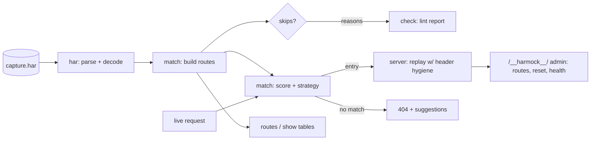

# harmock

[English](README.md) | [中文](README.zh.md) | [日本語](README.ja.md)

[](LICENSE) [](go.mod) [](CHANGELOG.md)  [](CONTRIBUTING.md)

**harmock：an open-source, zero-dependency CLI that serves any HAR capture as a deterministic local mock API server — record real browser traffic once in DevTools, then demo and test against it offline forever, no hand-written stubs.**


```bash
git clone https://github.com/JaydenCJ/harmock && cd harmock
go build -o harmock ./cmd/harmock    # single static binary, stdlib only
```

> Pre-release: v0.1.0 is not tagged on a package registry yet; build from source as above (any Go ≥1.22).

## Why harmock?

Every frontend team eventually loses an afternoon to a flaky staging backend, an expired sandbox token, or a demo on conference Wi-Fi. The standard fix — a mock server — trades one problem for another: json-server wants you to design a fake database, WireMock and Mockoon want you to hand-write stub definitions per endpoint, and Prism needs an OpenAPI spec your backend team may not have. Meanwhile a perfect description of your API already exists: the HAR file your browser records on every DevTools session, with real status codes, real headers, real bodies, and real timing. harmock serves that file directly. Open DevTools, click through the flow once, "Save all as HAR with content", and `harmock serve capture.har` gives you a mock backend that answers exactly like production did — including the tricky parts: it picks the right recording by query and request body, replays duplicate captures of the same endpoint in recorded order (so a `pending → running → done` polling flow works), and strips the recorded `Content-Encoding` so decoded HAR bodies do not corrupt responses.

| | harmock | json-server | Mockoon | WireMock | Prism |
|---|---|---|---|---|---|
| Serves recorded traffic without writing stubs | ✅ | ❌ | ⚠️ partial (own recorder) | ⚠️ partial (proxy record) | ❌ needs OpenAPI |
| Input is a plain DevTools export | ✅ | ❌ | ❌ | ❌ | ❌ |
| Stateful sequential replay of duplicate recordings | ✅ | ❌ | ❌ | ⚠️ scenarios, hand-defined | ❌ |
| Matches on query + JSON body, not just path | ✅ | ❌ | manual rules | manual rules | schema only |
| Runtime dependencies | 0 (single binary) | Node + deps | Electron/Node | JVM | Node + deps |
| Offline, no telemetry, binds 127.0.0.1 | ✅ | ✅ | ⚠️ desktop app | ✅ | ✅ |

<sub>Dependency counts checked 2026-07-13: harmock imports the Go standard library only; json-server 1.0.0-beta pulls 21 packages from npm, @stoplight/prism-cli pulls 60+.</sub>

## Features

- **Zero stubs, zero config** — the HAR file *is* the configuration. Any capture from Chrome, Firefox, Safari, a proxy, or a crawler serves as-is; broken entries are skipped with a reason, never fatal.
- **Deterministic score-based matching** — method + path must match, then query parameters, request bodies (byte-exact or JSON-structural, so key order never matters), and opt-in headers rank the candidates. Same capture + same requests = same responses, every run.
- **Sequential replay for stateful flows** — an endpoint captured three times replays `pending → running → done` in recorded order and then sticks at the final state; `POST /__harmock__/reset` rewinds between test runs.
- **Faithful responses, corrected where it counts** — recorded status, headers, and bodies are replayed verbatim, minus hop-by-hop headers and the stale `Content-Encoding`/`Content-Length` that would corrupt decoded bodies; binary payloads come back byte-identical.
- **Diagnosable 404s** — unmatched requests get a JSON payload naming the request and up to three near-miss suggestions, so "why didn't it match" takes seconds, not minutes.
- **Frontend-friendly switches** — `--cors` overrides recorded CORS and answers unrecorded preflights, `--strip-prefix` and `--host` adapt captures to your dev setup, `--latency record` restores real timing for loading-state work.
- **Offline and private by design** — stdlib only, binds `127.0.0.1` unless you say otherwise, sends nothing anywhere, ever.

## Quickstart

```bash
go build -o harmock ./cmd/harmock
./harmock serve examples/petstore.har
```

Real captured output:

```text
harmock: serving 9 routes from examples/petstore.har
harmock: listening on http://127.0.0.1:8080 (strategy=sequential)
harmock: admin at http://127.0.0.1:8080/__harmock__/health
```

Then, from another terminal — the job endpoint was captured three times, and harmock replays the recordings in order:

```bash
curl http://127.0.0.1:8080/api/jobs/42   # → {"id":42,"status":"pending"}
curl http://127.0.0.1:8080/api/jobs/42   # → {"id":42,"status":"running"}
curl http://127.0.0.1:8080/api/jobs/42   # → {"id":42,"status":"done"}
```

Inspect a capture before serving it:

```bash
./harmock routes examples/petstore.har
```

```text
#   METHOD  PATH                ST  TYPE        SIZE  NOTE
#0  GET     /api/pets?limit=2  200  json         99B
#1  GET     /api/pets/1        200  json         46B
#2  POST    /api/pets          201  json         46B
#3  GET     /api/jobs/42       200  json         28B  replay 1/3
#4  GET     /api/jobs/42       200  json         28B  replay 2/3
#5  GET     /api/jobs/42       200  json         25B  replay 3/3
#6  GET     /logo.png          200  png          70B
#7  DELETE  /api/pets/2        204  -             0B
#8  GET     /analytics.js      200  javascript   25B
```

## CLI reference

`harmock [serve|routes|show|check|version] <capture.har> [flags]`. Exit codes: 0 ok, 1 check findings, 2 usage error, 3 runtime error.

| Flag (serve) | Default | Effect |
|---|---|---|
| `--port` / `--addr` | `8080` / `127.0.0.1` | where to listen (`--port 0` picks a free port) |
| `--strategy` | `sequential` | duplicate-recording replay: `sequential`, `first`, `last` |
| `--ignore-query` | — | query key excluded from matching, e.g. cache busters (repeatable) |
| `--match-body` | `auto` | request-body matching: `auto`, `always`, `never` |
| `--match-header` | — | request header that participates in matching (repeatable) |
| `--host` | all hosts | serve only entries recorded against this host (repeatable) |
| `--strip-prefix` | — | remove a leading path segment from recorded paths |
| `--cors` | off | permissive CORS override + preflight answers |
| `--latency` | `none` | response delay: `none`, `record` (capped 3 s), or fixed ms |
| `--fallback-status` | `404` | status for unmatched requests |
| `--no-admin` / `--quiet` | off | disable `/__harmock__/` endpoints / per-request logging |

`routes` and `check` accept `--host`, `--strip-prefix`, and `--format text|json`; `show` takes `--entry N` or `--route "GET /path"`. The matching model — score weights, strategies, and header rewriting — is specified in [docs/matching.md](docs/matching.md).

## Verification

This repository ships no CI; every claim above is verified by local runs:

```bash
go test ./...            # 90 deterministic tests, offline, < 5 s
bash scripts/smoke.sh    # serves the example capture and asserts on real HTTP, prints SMOKE OK
```

## Architecture



## Roadmap

- [x] v0.1.0 — HAR 1.2 parsing, score-based matching (query/body/header), sequential/first/last replay, serve/routes/show/check subcommands, admin reset, CORS + latency simulation, 90 tests + smoke script
- [ ] `harmock record` — capture HAR from a local proxy, closing the record→replay loop without a browser
- [ ] Path templating (`/api/pets/{id}`) for matching unrecorded IDs against the closest recording
- [ ] Response templating: patch recorded bodies with request values (echo an ID back)
- [ ] Hot reload on capture-file change for live editing sessions
- [ ] `--merge` to serve several HAR files as one API

See the [open issues](https://github.com/JaydenCJ/harmock/issues) for the full list.

## Contributing

Issues, discussions and pull requests are welcome — see [CONTRIBUTING.md](CONTRIBUTING.md) for the local workflow (format, vet, tests, `SMOKE OK`). Good entry points are labelled [good first issue](https://github.com/JaydenCJ/harmock/issues?q=is%3Aissue+is%3Aopen+label%3A%22good+first+issue%22), and design questions live in [Discussions](https://github.com/JaydenCJ/harmock/discussions).

## License

[MIT](LICENSE)
