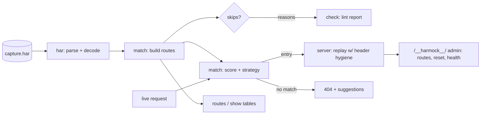

# harmock

[English](README.md) | [中文](README.zh.md) | [日本語](README.ja.md)

[](LICENSE) [](go.mod) [](CHANGELOG.md)  [](CONTRIBUTING.md)

**harmock：开源、零依赖的 CLI，把任意 HAR 抓包直接变成确定性的本地 mock API 服务器——用 DevTools 录一次真实浏览器流量，之后就能永远离线演示和测试，不用手写任何 stub。**


```bash
git clone https://github.com/JaydenCJ/harmock && cd harmock
go build -o harmock ./cmd/harmock    # single static binary, stdlib only
```

> 预发布：v0.1.0 尚未发布到任何包仓库；请按上述方式从源码构建（Go ≥1.22 均可）。

## 为什么选 harmock？

每个前端团队迟早都会因为不稳定的 staging 后端、过期的沙箱 token 或会场 Wi-Fi 上的演示而浪费一个下午。标准解法——mock 服务器——只是用一个问题换另一个：json-server 要你设计一个假数据库，WireMock 和 Mockoon 要你逐个端点手写 stub 定义，Prism 则需要一份后端团队未必有的 OpenAPI 规范。而你的 API 其实早已有一份完美描述：浏览器在每次 DevTools 会话里录下的 HAR 文件，里面是真实的状态码、真实的响应头、真实的 body 和真实的耗时。harmock 直接把这个文件端上来。打开 DevTools，把流程点一遍，"Save all as HAR with content"，然后 `harmock serve capture.har` 就给你一个应答与当时生产环境完全一致的 mock 后端——连难点都处理好了：它按查询参数和请求体挑出正确的录制条目，把同一端点的多次抓包按录制顺序回放（所以 `pending → running → done` 的轮询流程能正常工作），并剥掉录制里的 `Content-Encoding`，避免已解码的 HAR body 损坏响应。

| | harmock | json-server | Mockoon | WireMock | Prism |
|---|---|---|---|---|---|
| 直接服务录制流量、无需写 stub | ✅ | ❌ | ⚠️ 部分（自带录制器） | ⚠️ 部分（代理录制） | ❌ 需要 OpenAPI |
| 输入就是普通的 DevTools 导出文件 | ✅ | ❌ | ❌ | ❌ | ❌ |
| 重复录制的有状态顺序回放 | ✅ | ❌ | ❌ | ⚠️ 场景需手工定义 | ❌ |
| 按查询参数 + JSON body 匹配，而不只是路径 | ✅ | ❌ | 手写规则 | 手写规则 | 仅 schema |
| 运行时依赖 | 0（单二进制） | Node + 依赖 | Electron/Node | JVM | Node + 依赖 |
| 离线、无遥测、绑定 127.0.0.1 | ✅ | ✅ | ⚠️ 桌面应用 | ✅ | ✅ |

<sub>依赖数核对于 2026-07-13：harmock 仅引用 Go 标准库；json-server 1.0.0-beta 从 npm 拉取 21 个包，@stoplight/prism-cli 拉取 60+ 个。</sub>

## 特性

- **零 stub、零配置** —— HAR 文件*就是*配置。Chrome、Firefox、Safari、代理或爬虫的任何抓包都能原样服务；坏掉的条目会带原因跳过，绝不整体失败。
- **确定性的打分匹配** —— 方法 + 路径必须一致，再由查询参数、请求体（字节精确或 JSON 结构相等，键序永远无关）以及可选启用的请求头给候选排序。同样的抓包 + 同样的请求 = 每次都相同的响应。
- **有状态流程的顺序回放** —— 录了三次的端点按录制顺序回放 `pending → running → done`，之后停在最终状态；`POST /__harmock__/reset` 可在测试轮次之间倒带。
- **忠实回放，关键处修正** —— 录制的状态码、响应头和 body 原样回放，但剔除逐跳头以及会损坏已解码 body 的过期 `Content-Encoding`/`Content-Length`；二进制载荷逐字节一致地返回。
- **可诊断的 404** —— 未匹配的请求会收到一个 JSON 载荷，写明请求本身和至多三条近似建议，"为什么没匹配上"几秒钟就有答案，而不是几分钟。
- **面向前端的开关** —— `--cors` 覆盖录制的 CORS 并应答未录制的预检，`--strip-prefix` 和 `--host` 让抓包适配你的开发环境，`--latency record` 还原真实耗时以便调加载态。
- **生而离线、生而私密** —— 仅标准库，除非你明确指定否则只绑定 `127.0.0.1`，永远不向任何地方发送任何东西。

## 快速上手

```bash
go build -o harmock ./cmd/harmock
./harmock serve examples/petstore.har
```

真实捕获的输出：

```text
harmock: serving 9 routes from examples/petstore.har
harmock: listening on http://127.0.0.1:8080 (strategy=sequential)
harmock: admin at http://127.0.0.1:8080/__harmock__/health
```

然后在另一个终端——job 端点被抓包了三次，harmock 按顺序回放这些录制：

```bash
curl http://127.0.0.1:8080/api/jobs/42   # → {"id":42,"status":"pending"}
curl http://127.0.0.1:8080/api/jobs/42   # → {"id":42,"status":"running"}
curl http://127.0.0.1:8080/api/jobs/42   # → {"id":42,"status":"done"}
```

服务之前先检视一个抓包：

```bash
./harmock routes examples/petstore.har
```

```text
#   METHOD  PATH                ST  TYPE        SIZE  NOTE
#0  GET     /api/pets?limit=2  200  json         99B
#1  GET     /api/pets/1        200  json         46B
#2  POST    /api/pets          201  json         46B
#3  GET     /api/jobs/42       200  json         28B  replay 1/3
#4  GET     /api/jobs/42       200  json         28B  replay 2/3
#5  GET     /api/jobs/42       200  json         25B  replay 3/3
#6  GET     /logo.png          200  png          70B
#7  DELETE  /api/pets/2        204  -             0B
#8  GET     /analytics.js      200  javascript   25B
```

## CLI 参考

`harmock [serve|routes|show|check|version] <capture.har> [flags]`。退出码：0 正常，1 check 发现问题，2 用法错误，3 运行时错误。

| 标志（serve） | 默认值 | 作用 |
|---|---|---|
| `--port` / `--addr` | `8080` / `127.0.0.1` | 监听位置（`--port 0` 自动选空闲端口） |
| `--strategy` | `sequential` | 重复录制的回放策略：`sequential`、`first`、`last` |
| `--ignore-query` | — | 匹配时忽略的查询键，例如缓存戳（可重复） |
| `--match-body` | `auto` | 请求体匹配：`auto`、`always`、`never` |
| `--match-header` | — | 参与匹配的请求头（可重复） |
| `--host` | 所有主机 | 只服务录制自该主机的条目（可重复） |
| `--strip-prefix` | — | 从录制路径中去掉前导路径段 |
| `--cors` | 关 | 宽松 CORS 覆盖 + 预检应答 |
| `--latency` | `none` | 响应延迟：`none`、`record`（封顶 3 秒）或固定毫秒数 |
| `--fallback-status` | `404` | 未匹配请求的状态码 |
| `--no-admin` / `--quiet` | 关 | 禁用 `/__harmock__/` 端点 / 关闭逐请求日志 |

`routes` 与 `check` 接受 `--host`、`--strip-prefix` 和 `--format text|json`；`show` 用 `--entry N` 或 `--route "GET /path"`。匹配模型——打分权重、策略与响应头改写——完整规范见 [docs/matching.md](docs/matching.md)。

## 验证

本仓库不附带 CI；上面的每一条声明都由本地运行验证：

```bash
go test ./...            # 90 deterministic tests, offline, < 5 s
bash scripts/smoke.sh    # serves the example capture and asserts on real HTTP, prints SMOKE OK
```

## 架构



## 路线图

- [x] v0.1.0 —— HAR 1.2 解析、打分匹配（查询/请求体/请求头）、sequential/first/last 回放、serve/routes/show/check 子命令、管理端 reset、CORS + 延迟模拟、90 个测试 + smoke 脚本
- [ ] `harmock record` —— 通过本地代理抓取 HAR，不用浏览器也能闭环录制→回放
- [ ] 路径模板（`/api/pets/{id}`），让未录制的 ID 匹配到最接近的录制
- [ ] 响应模板：用请求里的值修补录制的 body（把 ID 回显出去）
- [ ] 抓包文件变更时热重载，支持边改边试
- [ ] `--merge` 把多个 HAR 文件合并成一个 API 服务

完整列表见 [open issues](https://github.com/JaydenCJ/harmock/issues)。

## 贡献

欢迎 issue、讨论和 PR——本地工作流（格式化、vet、测试、`SMOKE OK`）见 [CONTRIBUTING.md](CONTRIBUTING.md)。入门任务标注为 [good first issue](https://github.com/JaydenCJ/harmock/issues?q=is%3Aissue+is%3Aopen+label%3A%22good+first+issue%22)，设计讨论在 [Discussions](https://github.com/JaydenCJ/harmock/discussions)。

## 许可证

[MIT](LICENSE)
